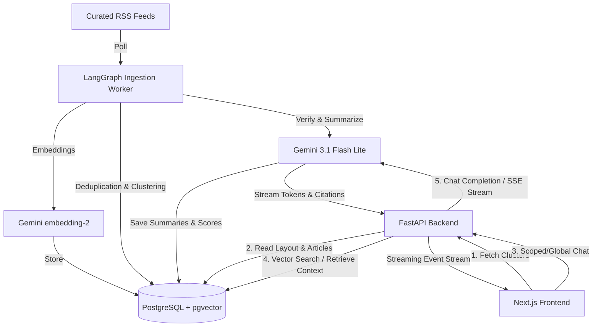

# Daily Intelligence — AI-Synthesized News & RAG Chat

Welcome to **Daily Intelligence**, a full-stack, AI-powered news aggregator and conversational search application. Daily Intelligence gathers articles from major RSS feeds, clusters them semantically, dynamically determines their prominence (mimicking a traditional physical front-page newspaper layout), and allows users to ask questions grounded directly in the news sources.

It serves as an advanced demonstration of Retrieval-Augmented Generation (RAG), stateful orchestration using LangChain, LangGraph, and a highly interactive, responsive web experience.

---

## 🌟 Key Features

1. **Newspaper Front-Page Grid Layout**
   - Articles covering the same news event are automatically grouped into a single **story cluster**.
   - Each story card's size is determined dynamically by an **importance score** (assigning cards to *Lead*, *Major*, *Standard*, or *Brief* grid tiles), replicating editorial layout hierarchies without human curation.
   - Summaries and headlines are synthesized across all source outlets by an LLM to give you a unified overview.

2. **Stateful Ingestion & Synthesis Pipeline**
   - Implemented as a stateful graph using LangChain, LangGraph.
   - Fetches feed items $\rightarrow$ deduplicates by canonical URLs $\rightarrow$ embeds article title and description $\rightarrow$ clusters articles via vector similarity $\rightarrow$ scores and synthesizes cohesive summaries.
   - Includes **validation and critique loops** (e.g., verifying cluster matches, checking summaries for hallucinations or unsupported claims) that feed back into earlier nodes to self-correct.

3. **Multi-Scope RAG Chat**
   - **Story-Scoped Chat**: Clicking any card opens a sidebar chat session restricted only to the source articles within that story cluster.
   - **Global News Chat**: An open-ended chat interface to query the entire indexed corpus (within a rolling time window), backed by vector search.
   - **Source Citations**: All AI responses stream citation metadata back to the UI, explicitly highlighting which news outlets contributed to the answer.

4. **Date-Wise News Filtering**
   - Filter front-page story clusters by date using a calendar control, rendering the news layout as it was on any given day.

---

## 🏗️ Architecture



---

## 🛠️ Technology Stack

* **Frontend:**
  - **Framework:** Next.js 16 (App Router, React 19, TypeScript)
  - **Styling:** Tailwind CSS v4, Vanilla CSS
  - **Markdown Rendering:** React Markdown & Remark GFM (for rich chat responses)
* **Backend:**
  - **API Framework:** FastAPI (Python)
  - **Orchestration:** LangChain & LangGraph (for both the ingestion pipeline and the RAG chat loop)
  - **Production Server:** Uvicorn
* **Database & Search:**
  - **Database:** PostgreSQL (Hosted on Neon)
  - **Vector Search:** `pgvector` extension (handling dense vector embeddings and cosine similarity searches)
* **AI Engine:**
  - **LLM:** Google Gemini (`gemini-3.1-flash-lite`)
  - **Embeddings:** Google Gemini Embedding (`models/gemini-embedding-2`)

---

## 📁 Repository Structure

```
├── Backend/                    # FastAPI python backend
│   ├── app/
│   │   ├── config.py           # Configuration loading (Pydantic Settings)
│   │   ├── db.py               # Database connections, tables & seed sources
│   │   ├── ingest.py           # Ingestion pipeline entry point
│   │   ├── main.py             # FastAPI App Lifespan and server entry point
│   │   ├── models.py           # Pydantic schemas / DB models
│   │   ├── ingestion/          # LangGraph state nodes, edges, & clustering logic
│   │   ├── rag/                # LangGraph RAG chat agent
│   │   ├── routers/            # FastAPI Endpoint routes (clusters, chat, ingest)
│   │   ├── schemas/            # Request/Response schemas
│   │   └── services/           # DB operations, Embedding & LLM abstraction
│   ├── requirements.txt        # Backend dependencies
│   └── .env                    # Local environment variables
│
├── frontend/                   # Next.js React frontend
│   ├── app/                    # Next.js App Router pages
│   ├── components/             # Reusable UI components (NewspaperGrid, Chat, etc.)
│   ├── public/                 # Static assets
│   ├── package.json            # Node.js dependencies & scripts
│   └── .env                    # Frontend environment variables
└── daily-intelligence-prd.md  # Product Requirements Document
```

---

## 📊 Importance Scoring & Sizing

* **Outlet Count:** The number of independent sources covering the event (the core signal of scale).
* **Recency Decay:** Exponential decay factor reducing a story's score as it ages, ensuring the front page remains fresh.
* **Category Weight:** A tunable multiplier prioritizing critical categories (e.g., *World* or *India* news over *Lifestyle* or *Entertainment*).

### Size Tiers
Based on percentile ranks, story clusters are classified into:
* **Lead** (Highest score, largest banner card)
* **Major** (Medium-large cards)
* **Standard** (Default sized cards)
* **Brief** (Small lists or micro cards)

---

## 🚀 Getting Started

### 1. Database & Vector Extension Setup
The backend requires a PostgreSQL database with the `pgvector` extension enabled.
If you are using Neon, it is enabled by default. The database initialization script (`Backend/app/db.py`) will automatically execute `CREATE EXTENSION IF NOT EXISTS vector;` and build the tables during backend startup.

### 2. Backend Setup
1. Navigate to the backend directory:
   ```bash
   cd Backend
   ```
2. Create a virtual environment and activate it:
   ```bash
   python -m venv venv
   source venv/bin/activate  # On Windows: venv\Scripts\activate
   ```
3. Install the dependencies:
   ```bash
   pip install -r requirements.txt
   ```
4. Create a `.env` file in the `Backend` directory containing:
   ```env
   DATABASE_URL=postgresql://<user>:<password>@<host>/<dbname>?sslmode=require
   GEMINI_API_KEY=your_gemini_api_key
   GEMINI_MODEL=gemini-3.1-flash-lite
   ENABLE_BACKGROUND_INGESTION=False  # Set to True to poll in the background
   BACKGROUND_INGESTION_INTERVAL_HOURS=12.0
   ```
5. Run the FastAPI development server:
   ```bash
   uvicorn app.main:app --host 0.0.0.0 --port 8000 --reload
   ```

#### Manually Triggering Ingestion
You can populate the database with fresh news articles by running the pipeline script directly:
```bash
python -m app.ingest
```
Alternatively, hit the local API endpoint (e.g. via Postman or browser):
* **Trigger async:** `POST http://localhost:8000/api/ingest`
* **Trigger sync & debug:** `GET http://localhost:8000/api/ingest/debug`

---

### 3. Frontend Setup
1. Navigate to the frontend directory:
   ```bash
   cd frontend
   ```
2. Install the node packages:
   ```bash
   npm install
   ```
3. Create a `.env` file in the `frontend` directory containing:
   ```env
   NEXT_PUBLIC_API_URL="http://localhost:8000"
   ```
4. Start the development server:
   ```bash
   npm run dev
   ```
5. Open [http://localhost:3000](http://localhost:3000) in your browser.

---

## 🔒 Database Schema Details

The database initializes the following tables:
* **`sources`**: Curated RSS feed endpoints (seeded with NDTV, Times of India, CNN, BBC, CNBC, TechCrunch, etc.).
* **`articles`**: Raw articles scraped from feeds, including title, description, publication date, image url, source ID, and vector embedding (`vector(3072)`).
* **`clusters`**: Generated events grouping similar articles, hosting LLM synthesized summaries, categories, importance scores, and a summary embedding (`vector(3072)`).
* **`cluster_articles`**: Junction table mapping many-to-many associations between articles and clusters.
* **`chat_messages`**: Persistent conversational history for both story-scoped and global chat sessions.
